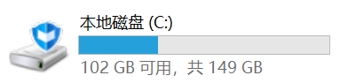

# SeewoMonitorSystem

由于班主任时不时通过希沃的巡课系统（俗称监控）来查看上课情况，这对学生来说当然不是一个好消息。因此，本反监控系统就是监控希沃，并在有异常情况时立即报告。

# 原理

希沃巡课系统主要依赖3个程序，`media_capture.exe`，`screenCapture.exe`，`rtcRemoteDesktop.exe`，而`media_capture.exe`就是负责获取摄像头数据的。
因此，不断查询当前进程列表并检查是否有`media_capture`就能大致确定（[这种方法并不完全准确](#局限性)）是否有老师正在看监控。

# 主要构成
- [SeewoMonitor](#SeewoMonitor)
- [Sound](#Sound)
- [RubbishCleaner](#RubbishCleaner)

## SeewoMonitor

SeewoMonitor目前有以下两个版本，负责监控进程并以指示块的形式报告情况

### SeewoMonitor
这是第一个版本，以大约`1次/秒`的速度检测`media_capture.exe`。
当检测到`media_capture.exe`在运行时，就认为监控系统正在运行，并在屏幕上方正中偏右2像素的位置（这其实是个失误，原计划是上方正中间）显示一个4x4像素的红色方块。
当`media_capture.exe`结束运行时，就认为本次监控结束，红色方块消失。

### SeewoMonitor2
  

这是`SeewoMonitor`升级版，这个版本除了检测在[原理](#原理)中提到的三个程序之外，还会监控上传网速，以大约`0.5轮/秒`的速度检测。
下图解释了SeewoMonitor2管理的4个色块的位置和触发条件。

## Sound

监控`media_capture.exe`并且播放声音来告知情况。
当开始运行时，播放Windows硬件插入的系统提示音；当结束运行时，播放Windows硬件拔出的系统提示音。
为了确保提示音能够播放，该程序会检测系统音量，如果系统音量低于设定阈值（默认`-10.5dB`），就先拉高系统音量到阈值再播放提示音，提示音播放完成再调回系统原音量；
如果当前系统音量大于设定阈值，就不改变音量。
但是，无论哪种情况，该程序都会解除静音并且不会恢复静音。

## RubbishCleaner

监控[原理](#原理)中提到的3个程序和上传网速，如果上传网速低持续1分钟，就尝试终止之前提到的3个程序。
监控程序不会主动结束进程，因此需要本程序

>[!IMPORTANT]
>此程序必须要能够成功调用`Nsudo.exe`才能发挥作用，因为需要提权。如果你有其他提权方案，自行更改此程序源码。
>有关`Nsudo.exe`，请参阅 [Nsudo](https://github.com/M2TeamArchived/NSudo)

# 使用本项目
## 打包成exe

1. 运行`pip.bat`安装依赖库
2. 使用`pyinstaller SeewoMonitor2.py -F -w`命令打包

> [!CAUTION]
> 使用`pyinstaller`打包的exe会被`WindowsDeferder`等报毒为特洛伊木马，程序本身并没有病毒
> 要使用`RubbishCleaner.exe`，请注意`Nsudo.exe`

## 添加自启动（可选）

> [!IMPORTANT]
> 执行此操作前请确保`冰点还原`处于关闭状态，打开`explorer`，如果`C`盘是下图所示状态，则表明`C`盘被冻结，添加的自启动重启就会失效。
> 
> 
> 
> 如果`冰点还原`是开启状态，你需要先关闭`冰点还原`，有关无密码关`冰点还原`的方法，预计1月后补充。

添加自启动有3种方法，可以使用`explorer``regedit`或`cmd`添加。

 使用`explorer`添加（最安全） 

打开`explorer`，在地址栏输入`shell:startup`，将指向想要添加自启动的程序的快捷方式复制进入即可

 使用`regedit`进行图形化操作 

> [!NOTE]
> `regedit`对屏幕键盘的支持很奇怪，如此方法不行请使用命令行添加。

> [!CAUTION]
> 注册表是Windows系统的核心数据库，不当的操作可能导致系统异常、崩溃甚至无法开机，> 一般情况下不建议修改注册表，除非你**明确的**知道你正在修改的项或值的作用及后果。
> 推荐使用`explorer`添加自启动。

1. 按下`Win`+`R`，输入`regedit`并回车。
2. 定位到`计算机\HKEY_CURRENT_USER\Software\Microsoft\Windows\CurrentVersion\Run`，选中`Run`，右边展示的就是部分自启动项（因为Windows的自启动有多个设置的地方，启动优先级互不相同）。
3. 在右侧右键，`新建`->`字符串值`，随便起一个名字（最好为英文）
4. 双击新建的值，将要自启动的程序绝对路径填入即可。

<datails>

 使用`cmd`命令行添加 

> [!CAUTION]
> 本方法的本质是添加注册表启动项。
> 注册表是Windows系统的核心数据库，不当的操作可能导致系统异常、崩溃甚至无法开机，
> 一般情况下不建议修改注册表，除非你**明确的**知道你正在修改的项或值的作用及后果。
> 推荐使用`explorer`添加自启动。

假设你要添加自启动的程序路径为`D:\test folder\SeewoMonitor.exe`，以管理员或更高权限运行命令行，通过命令创建一个名为SeewoMonitor的自启动项

`reg add "HKCU\Software\Microsoft\Windows\CurrentVetsion\Run" \v SeewoMonitor \t REG_SZ \d "D:\test folder\SeewoMonitor.exe`

注意，自启动项不能重名。
</datails>

# 局限性

[原理](#原理)中提到的3个程序有时候会自己启动，导致误报。不过1分钟后就会被[RubbishCleaner](#RubbishCleaner)清除。
目前尚不清楚相关机制。
