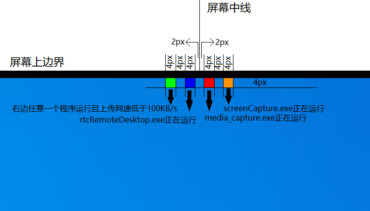

# SeewoMonitorSystem

由于班主任时不时通过希沃的巡课系统（俗称监控）来查看上课情况，这对学生来说当然不是一个好消息。因此，本反监控系统就是监控希沃，并在有异常情况时立即报告。

# 原理

希沃巡课系统主要依赖3个程序，`media_capture.exe`，`screenCapture.exe`，`rtcRemoteDesktop.exe`，而`media_capture.exe`就是负责获取摄像头数据的。
因此，不断查询当前进程列表并检查是否有`media_capture`就能大致确定（[这种方法并不完全准确](#问题)）是否有老师正在看监控。

# 主要构成
- [SeewoMonitor](#SeewoMonitor)
- [Sound](#Sound)
- [RubbishCleaner](#RubbishCleaner)

## SeewoMonitor

SeewoMonitor有两个版本，这里先介绍旧版

### SeewoMonitor

这是第一个版本，以大约`1次/秒`的速度检测`media_capture.exe`。
当检测到`media_capture.exe`在运行时，就认为监控系统正在运行，并在屏幕上方正中偏右2像素的位置（这其实是个失误，原计划是上方正中间）显示一个4x4像素的红色方块。
当`media_capture.exe`结束运行时，就认为本次监控结束，红色方块消失。

### SeewoMonitor2

这是`SeewoMonitor`升级版，这个版本除了检测在[原理](#原理)章节提到的三个程序之外，还会监控上传网速，以大约`0.5轮/秒`的速度检测。
下图解释了SeewoMonitor2管理的4个色块的位置和触发条件。

## Sound

监控`media_capture.exe`并且播放声音来告知情况。
当开始运行时，播放Windows硬件插入的系统提示音；当结束运行时，播放Windows硬件拔出的系统提示音。

## RubbishCleaner

监控[原理](#原理)章节提到的3个程序和上传网速，如果上传网速低持续1分钟，就尝试终止之前提到的3个程序。
>[!CAUTION]
>此程序必须要能够成功调用`Nsudo.exe`才能发挥作用

# 问题

[原理](#原理)章节提到的3个程序有时候会自己莫名其妙启动，导致误报，所以有了[RubbishCleaner](#RubbishCleaner)
